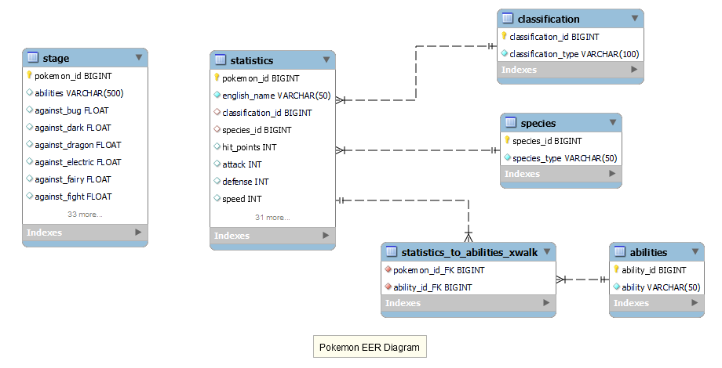

# An Amazon RDS MySQL Instance: Design and Implementation

Amazon's Relational Database Service (RDS) is a straightforward, yet powerful way to transition database projects to the cloud. Established workflows are largely preserved, while Amazon handles database administration: maintaining the file system, provisioning backups, and applying software updates and security fixes. They offer different sizes from the tiny 1 core, 1 GiB RAM *db.t2.micro* on the Free Tier to the more realistic *db.m5.4xlarge*  with 16 cores and 64GiB of RAM. Auto-scaling is also available for high-availibity databases with variable useage patterns.

Of course, none of this is free: the aforementioned *db.m5.4xlarge* costs $1.37 per instance hour, or $986 per month for 24/7 access. Hosting the database in multiple Availability Zones to ensure reliablity doubles (or triples) this cost. Automated backups, snapshots, and logs are other expenses. Without a commitment to cost management, the savings advantages of the cloud are easily lost to these extraneous expenses.

Nevertheless, the cloud is here to stay; now is the time to make nice, and configuring a SQL database using Amazon's RDS service is an excellent first step.

To that end, this repository contains the neccessary resources to provision, configure, and load data into a MySQL insance hosted by Amazon's RDS. While (to manage costs) the database and data set are small, the workflow outlined here is scalable to much larger projects; in addition, Amazon's Virtual Private Cloud (VPC) and Identity and Access Management (IAM) services are incorporated to address the networking and security concerns of a live production database. The workflow is also easy to extend, and suggestions for possible improvements are provided in the **Summary** at the end of this document.

## Database and Data Summary

The database for this demonstration is a data warehouse with fact and dimension tables arranged in a star schema. The schema includes both one-to-many and many-to-many relations, and is generated by a series of SQL scripts. 

To ease the anxiety of learning something new, the data are descriptive statistics and attributes of 802 Pokemon. Python scripts are used to extract the dimension table values, which are then loaded with SQL scripts. An additional script loads the data into the staging table; from there, a stored procedure loads the data from staging into the normalized production tables. An additional procedure is provided to truncate the fact table so the data can be reloaded, and a non-updatable view displays the most commonly used fields while preserving underlying table normalization and data integrity. 

## AWS Considerations

While hosting a database through Amazon's RDS service is not difficult, there are several differences from traditional hosting to be aware of. For example, the root account for the database is in fact a "pseudo-root" without all standard permissions (including SUPER). The database also contains additional tables used by the RDS service for database management. Network and security configuration are handled entirely in the cloud with Amazon services. While it makes sense for Amazon to control these aspects, these differences may require modification of established business practices.

### Service Procurement and Database Creation

Establishing a database instance requires first provisioning an RDS instance. This requires an AWS account; fortunately, the options available on the Free Tier suffice for small projects. Provisioning an RDS instance for a standard SQL database such as MySQL is straightforward and will only take 10-15 minutes.

For a starter project, it is recommended to not enable logging or database snapshots: as noted above, both of these require additional resources, and it is easy to very quickly use the entire Free Tier allotment on them.

It is also crucial to make the database accessible to the general public for the initial setup, in order to troubleshoot connection and access issues in isolation.

Finally, it is worth installing and learning the basics of the AWS CLI in order to manage the database without logging into the console. This makes it simple to start and stop the RDS instance as needed, which is critical to manage costs for a sandbox project. If database access patterns are well-established, a short Linux script is easy to write to programmatically handle these tasks.

## Networking and Security

After the database is provisioned, the next step is to check connectivity using a MySQL client. If the database is publically accessible, this requires a MySQL account with the appropriate permissions and the database URL. 

Once connectivity is established, the next step is to isolate the instance from public use and set up role-based security. This requires the AWS Virtual Private Cloud (VPC) and Identity and Access Management (IAM) services. The VPC service is used to isolate the connection, while the IAM service manages role-based access and (if desired) group policies. The steps are as follows: 

1. Create a VPC (Virtual Private Cloud) to house the database
2. Create an Internet Gateway within the VPC and assign an Elastic IP Address
3. Configure a security group associated with this VPC
4. Create a database access role with appropriate privileges

(If connectivity is not established, the error message should help you narrow down the problem between basic connectivity, permissions, or something else; for this reason, it is helpful to try to connect using the MySQL CLI at first and to establish verbose logging until any issues are resolved.

Note that the most likely causes of basic connection failures--that is, failure to connect to the RDS instance at all--are either using the incorrect URL or trying to connect to a database that is not publically accessible. Both can be verified from the Console). 

### Networking with the Virtual Private Cloud

When the database was provisioned, you will have assigned it a VPC domain. This can either be an existing domain or a new one: the default is to create a new one, which is fine for this purpose. The VPC is an isolated network with its own security groups and access rules. These can be as strict or lenient as desired, and subnets can also be established within the VPC for even more control.

Here, it is enough to set up the default security groups so that access is only allowed to the database service port (3306 for MySQL; see the documentation for other engines) and restricted to a specific IP address or range of addresses. This should be done for both Inbound and Outbound connections.

The security group service will helpfully provide your current IP address; note, however, that if you are connecting through a VPN or other dynamically-assigned address (which is almost certainly the case if you are using a consumer Internet provider such as Comcast or AT&T) you will need to provide either the address range or each address that might be assigned.

Unless you know this information, the simplest way to resolve the issue is to start with your current IP address and then use a web service such as `whatsmyip.com` to find additional addresses if the initial connection attempt fails. Another option for consumer users is to use Amazon's VPN service.

Once steps 1 and 2 are done, users may connect to the database at the IP address assigned to the Internet Gateway using their database credentials (i.e. the MySQL-based login and password). After step 3, the user must be allowed by the security group to connect; typically, this is done by allowing a certain IP address range. Step 4 requires the user be authorized for the IAM credentials governing the RDS instance. 

Once connected, the user will have access to whatever resources and permissions their MySQL role allows: in other words, security of the database instance is done through the Amazon-provided VPC and security group, while security of database tables and assigned privileges are done through the MySQL client.

## The MySQL Database and Data

The database is named *pokemon* and generated via SQL scripts. There are six tables; one of these is the staging table *stage*, which contains unmodified data from the CSV file, while the remaining tables are the fact table (*statistics*), three dimension tables (*ability*, *classification*, and *species*), and the crosswalk table that joins the statistics to the ability table (*statistics_to_ability_xwalk*).

### Data Preparation

The data used was a small CSV file containing statistics for 802 Pokemon. These include its *abilities*, *attack strength*, *hit points*, and *speed*. Notwithstanding the small number of records, this data set posed several challenges to load into a normalized SQL database. These are:

* Each record contained several kanji characters (i.e. Japanese characters) that required additional processing. 
* Abilities for each record were recorded as a variable length array delimited by brackets (i.e. '[' and ']'). 
* The relationship between Pokemon and their abilities was many-to-many: each Pokemon could posess one or more abilities, and each ability could be used by several different Pokemon.

The first challenge was addressed by explictly specifying the character set for the LOAD operation as `utf8mb4`.

For the second challenge, a Python script was used to extract the array contents and return a list of unique abilities. This was exported to a file and loaded into the *ability* dimension table; the relevant code from the script is shown below.

The last challenge was addressed with a cross-walk table that mediated the relationship between the *statistics* and *abilities* tables. The stored procedure (described below) *load_staged_data* populated this table with the appropriate keys.

```python
	# Process each file row
    	for row in file_reader:
	
        # Get the *ability* field and remove brackets
        row_strip = row[ABILITY_FIELD].strip("[]")

        # Split the field into single-string elements
        for ability in row_strip.split(","):
	    
            # Remove unneeded chars and append
            ability_strip = ability.strip(" '")
            ability_list.append(ability_strip)

    # Make a new list with each unique ability

    # list(set(*)) removes dups (set) and returns a list
    unique_ability_list = list(set(ability_list))
    unique_ability_list.sort()

    return unique_ability_list
```
## Database Schema

This is the database schema conceptualized as an Entity-Relationship (ER).



### Stored Procedures

To transfer the staging data to the normalized tables, the stored procedure *load_staged_data* was written. This procedure used a cursor to insert each row of data from the staging table into the *statistics* table. The procedure then retrieved the last inserted ID and inserted it, along with the ability IDs of the abilities the Pokemon could use, into the crosswalk table.

Because the abilities in the staging table were stored in a pseudo-array, the procedure used the `INSTR()` function on the abilities field to determine the appropriate abilities for each row, and then selected the *ability_ID* from the abilities table corresponding to the selected values. This generated each set of entries into the crosswalk table without needing to split the abilities field in the staging table into individual elements. The code that performed this operation is shown below.

```SQL read_loop: loop
		fetch stage_cursor into pokemon_name, pokemon_abilities, pokemon_type;
		if done then 
			leave read_loop;
		end if;
		
		-- Get the species_id from the species table corresponding to the Pokemon's type
		-- so we can load that instead of the type
		
		select species_id from species where species_type = pokemon_type into new_species_id;
		
		-- Insert next pokemon into statistics table
		
		insert into statistics (english_name, classification, ... )
		select english_name, classification, ... from stage where english_name = pokemon_name;
	
		-- Insert the pokemon ID and ability_ids into the xwalk.
	
		set new_pokemon_id = last_insert_id();
	
		insert into statistics_to_abilities_xwalk (pokemon_id_FK, ability_id_FK)
		select new_pokemon_id, ability_id from abilities where instr(pokemon_abilities, ability);

		end loop;
```
Since the *classification* and *species* fields were normalized as separate tables, the cursor also inserted the appropriate foreign keys into the statistics table. An additional procedure, *reset_primary_tables*, was written to truncate the fact table and crosswalk prior to reloading the data.

## Summary

This project utilized the Amazon RDS service (and associated services) in order to create a MySQL data warehouse containing data on 802 Pokemon. Network access to the database was configured using Amazon's VPC service, and the RDS instance was secured using the IAM service. The database itself illustrates a basic star schema and is configured with appropriate permissions to secure access. The data was processed using a custom Python script and loaded into the database using both SQL LOAD operations and a stored procedure. Several challenges, including the presence of Japanese characters, the denormalized ability field, and the many-to-many relationship between Pokemon and their abilities were addressed. 

While the database itself is relatively small, the steps outlined here may easily be applied to much larger data sets. Hopefully, this brief discussion will encourage the use of Amazon's RDS service for similar projects.
